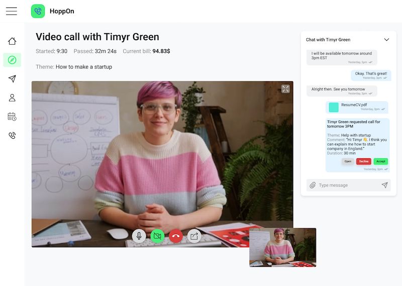
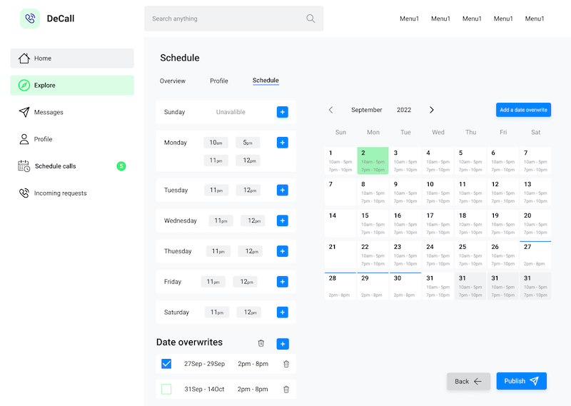

# DeCall - app for video calls with industry professionals

You can use it to ask questions about specific topic from someone who knows about it from experience.
For example:

-   ask advice on opening (medical, crypto, ect.) startup
-   take mock interview for (software engineer, university interview, ect.) position
-   how to start making content on (Medium, YouTube, ect.) about (education, ect.)
-   ect.

Or start sharing your knowledge with others - take calls and give useful advice on a topic that you are expert in

-   give advice on how to open (medical, ect.) startup in (Australia, Brasil, ect.)
-   how to open offshore account for business in (Switzerland, Singapore, ect.)
-   or whatever skill or knowledge that you have and think it will be usefull for someone

## Technologies used in project

### Frontend

-   Typescript
-   React
-   Next
-   Appolo (GraphQL)
-   Jest

### Backend

-   Typescript
-   PostgreSQL
-   Express
-   Appolo Server (GraphQL)
-   type-graphql
-   typeorm

## Setup

To run this project, install it locally using npm:

```
$ cd ./server
$ yarn install
$ cd ../web
$ yarn install
```

To run it start server and frontend:

```
$ cd ./server
$ yarn start
$ cd ../web
$ yarn dev
```

## Features

-   [x] Login/Register
-   [x] Creating/editing profile
-   [ ] Creating/editing schedule
-   [ ] Video call room
-   [ ] Scheduling calls
-   [ ] Explore page
-   [ ] Chat

## Some screens

### Video call room



### Setting schedule


